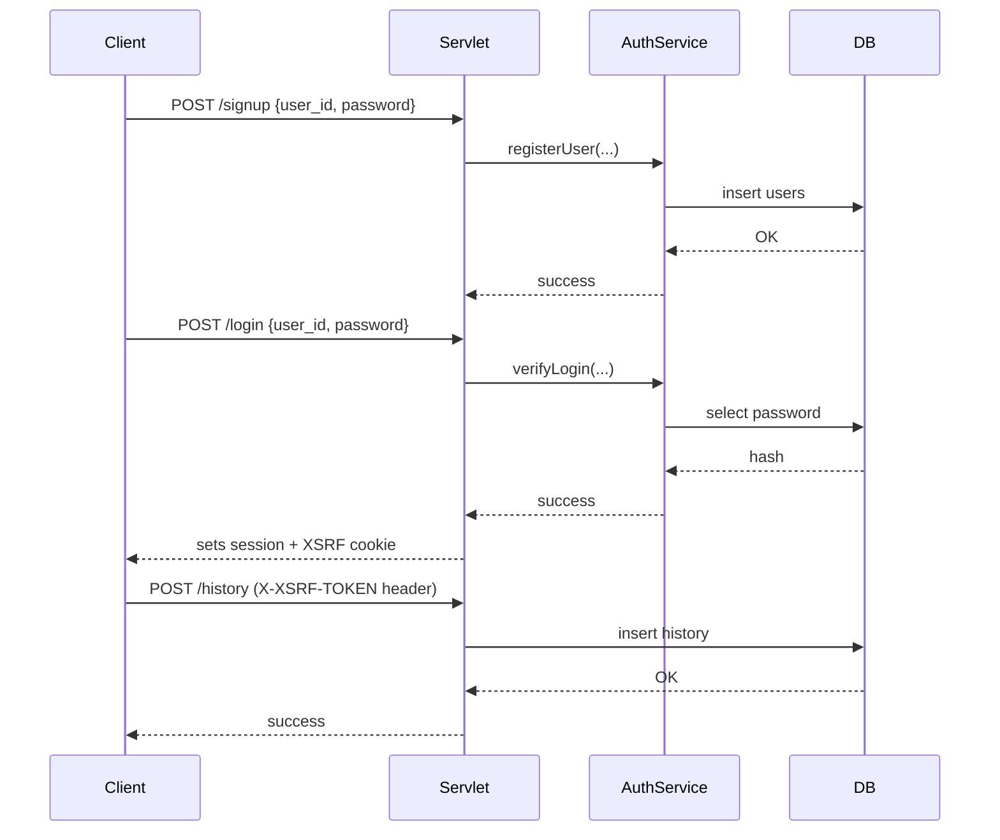

# Slides / Presentation Notes

Include these visuals in your submission slides:

1) MVC Architecture (mermaid)

```mermaid
flowchart LR
  A[Client (Browser / SPA)] -->|HTTP| B[Servlets (Controllers)]
  B --> C[Service Layer]
  C --> D[DAO Layer (`DBConnection`) / Repos]
  D --> E[(Database: MySQL / H2)]
  B --> F[SecurityFilter (CSRF, CSP)]
  C --> G[Recommendation Engine]
```

2) Sequence: Signup → Login → Add Favorite



Notes:
- Add screenshots or bullet points explaining throttling, CSRF, and ErrorHandler with trace-id.
